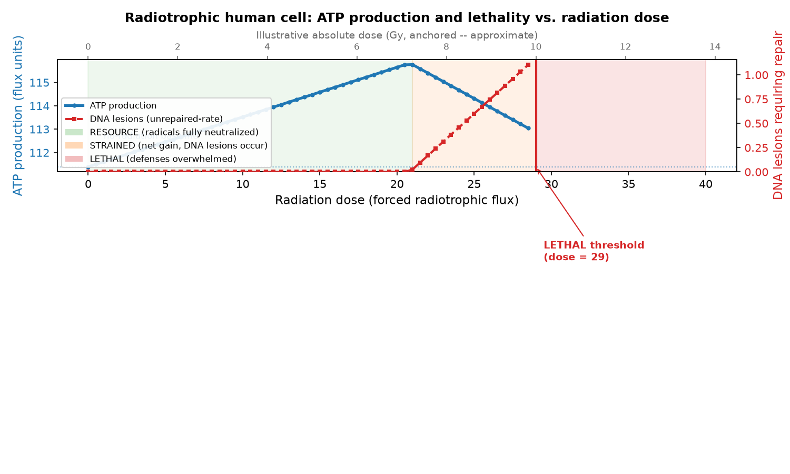

# Radiotrophic Human Cell Metabolism

A computational feasibility study of whether human cells could be engineered to
use **melanin-based radiotrophic metabolism** — capturing energy from ionizing
radiation, as melanized fungi (e.g. *Cladosporium* in the Chernobyl reactor)
appear to — while surviving the oxidative damage that radiation causes.

## The thesis

The point is **not** that radiotrophy out-earns glucose metabolism (it doesn't).
It is the more fundamental question:

> Can a human cell turn ionizing radiation into a **usable, survivable energy
> input** instead of suffering it as pure damage?

A normal human cell only loses to radiation (DNA damage, ROS, death). This study
asks whether melanin + a set of engineered ROS defenses can flip radiation from a
one-way hazard into a net-tolerable-to-beneficial resource — and where that
breaks down.

- **Null (H₀):** Radiation is a strict liability — any captured energy is
  outweighed by ROS/DNA damage, so the cell is worse off or dead.
- **Alternative (H₁):** With melanin + engineered defenses, a human cell routes
  radiation energy into ATP while keeping the damage survivable, up to some dose.

## Key finding

Under a **forced radiation dose** (a cell in a field cannot opt out), the model
produces a clear three-regime arc:

| Regime | Dose (model flux) | Behaviour |
|---|---|---|
| **RESOURCE** | ≤ ~21 | Net ATP gain; radical load 100% neutralized; zero DNA lesions |
| **STRAINED** | ~21–29 | Still net-positive, but defenses saturate → DNA lesions occur and are repaired at ATP cost |
| **LETHAL** | ≥ ~29 | ROS load exceeds SOD capacity → no feasible steady state (cell death) |



So radiation is a usable, survivable energy source **up to a defense-limited
ceiling**, costly beyond it, and fatal once the antioxidant defenses are
overwhelmed.

Supporting analyses (`plot_experiments.py`):
- **Ablation** (`fig_ablation.png`): **SOD** and **OH-scavenging** are each a
  single point of failure — knock out either and radiotrophy collapses to zero.
- **Bottleneck relief** (`fig_bottleneck_relief.png`): the ceiling is set by
  OH-neutralisation capacity (Dsup's 40% + the finite GSH pool), *not* by SOD —
  so adding MnSOD2 alone does nothing; relieving glutathione capacity is what
  lifts the ceiling.
- **Robustness** (`fig_ros_sensitivity.png`): the net benefit persists across the
  full range of the most uncertain parameter (ROS produced per NADH).

## Model

A constraint-based (flux-balance) metabolic model built with COBRApy:
**56 reactions, 52 metabolites** across cytosol / mitochondria / extracellular.
Includes glycolysis, TCA cycle, electron transport chain, melanin synthesis, a
novel radiotrophic NADH-generating reaction, and ROS defenses — native
(SOD / catalase / GPX / GSH) plus cross-species engineered (tardigrade **Dsup**,
*Deinococcus* **Mn-antioxidant**, naked-mole-rat-style **Nrf2**, **MnSOD2**).

Two modelling choices encode the key biology (and are the most recent fixes):
- **Dsup is capped at 40%** of radical interception (Hashimoto et al. 2016) via a
  coupling constraint — not the unlimited shielding FBA would otherwise exploit.
- **Glutathione scavenging is finite** (`GSH_SCAV_CAP`), so DNA damage can
  actually occur at high dose instead of being scavenged away for free. This is
  what makes the survival question testable.

A companion **kinetic ODE model** (`kinetic_model.py`, SciPy) covers time-resolved
dynamics (onset transients, pulse-recovery), and `dsup_analysis.py` scores the
Dsup gene-transfer feasibility.

## Repository layout

| File | What it is |
|---|---|
| `radiotrophic_model.py` | Core FBA model + all experiments (run this) |
| `kinetic_model.py` | Time-resolved ODE model |
| `dsup_analysis.py` | Dsup structural/feasibility assessment |
| `calibration.py` | Illustrative flux→Gy dose mapping (see caveat below) |
| `plot_radiation_atp.py` | Generates the dose/ATP/lethality figure |
| `test_model.py` | Invariant tests guarding the findings |
| `*.csv` | Generated experiment outputs |
| `plan.pdf` | Original project plan |

## Running it

```bash
pip install -r requirements.txt
python3 radiotrophic_model.py     # runs experiments, writes CSVs + model JSON
python3 plot_radiation_atp.py     # writes radiation_atp_lethality.png
python3 test_model.py             # 8 invariant tests
```

Results are **reproducible**: the LP solver is pinned to GLPK (deterministic) and
dependency versions are pinned in `requirements.txt`. Outputs are byte-identical
across runs.

## Important limitations (read before citing any number)

- **The radiation axis is not physical.** Model fluxes are *relative*, not
  dimensioned. A first-principles radiolysis calibration overshoots real lethal
  doses by ~10⁶ (see `calibration.py`), so absolute Gy values are **illustrative
  anchored estimates only**, not measurements.
- **No wet-lab validation.** Predictions are compared to published literature
  (`experimental_validation.csv`) but nothing here has been tested experimentally.
- **Lumped reactions & hand-set coefficients.** Glycolysis, the ETC, and melanin
  synthesis are simplified; several ROS/melanin stoichiometries are literature-
  guided estimates, not measured.
- **"Lethal" = no feasible steady state**, a reasonable proxy for cell death but
  not a calibrated survival curve.

See `PAPER_PLAN.md` for how these gaps map onto what a publishable write-up needs.

## References

Dadachova et al. 2007 (PLoS ONE); Hashimoto et al. 2016 (Nat. Commun.); Chavez et
al. 2019 (eLife); Daly et al. 2004 (Science); Shunk et al. 2022 (Front.
Microbiol.); Buxton et al. 1988 (radiolysis G-values); Lindahl & Barnes 2000.
